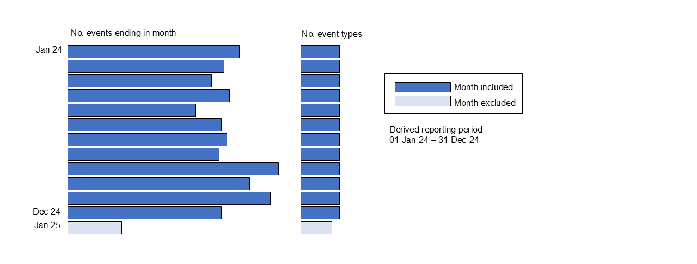

# Deriving accurate reporting periods

Reporting periods are **derived from the data**, not taken as stated in submissions.

## Method

For each submission:

- Count the number of events ending in each month.
- Events ending in or after the import month are excluded.
- Months are excluded if they contain:
  - fewer than **2% of total events**, or
  - fewer than **three out of four event types**
    (or fewer if the file does not contain all four event types).
- Take the reporting period as:
  - the **start of the first month**, to
  - the **end of the last month**.

If a submission contains fewer than 100 events in total, the stated reporting period start and end dates are used instead. These thresholds were selected such that derived reporting periods most closely match reporting periods deduced by scrutinising the underlying data.

## Rationale

Many local authorities submit reporting period dates that cover a longer period than the data actually included. This can result in submissions being selected for periods where they contain no data. Note that although local authorities may resubmit to fix these issues, the submissions made with inaccurate stated reporting periods are retained in the database.

 

[Back to selecting submissions](/Main_tables/docs/methodology/3-submission-selection.md)