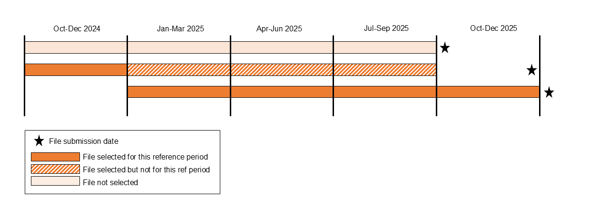

# Selecting submissions to cover the period

> Processing steps applied in [`GetSubmissions`](/Stored_procedures/create_GetSubmissions_procedure.sql) procedure.

[Back to Overview](/Main_tables/docs/methodology/1-overview.md)

## Selection logic

- [Reporting periods are derived](/Main_tables/docs/methodology/2-reporting-periods.md) from the data, not taken as stated in submissions.

- The most recently submitted data is assumed to be the most accurate.

- Submissions are selected **“as of” a fixed date**.
  This is typically 1–2 weeks after the quarterly submission deadline, to allow for late submissions and resubmissions.

- Where joining submissions, the reporting period is broken down into 3-month periods ("reference periods").

    |  | Rolling 12-month "single submissions" table | Full reporting period to date "joined submissions" table |
    | --- | --- | --- |
    | Reporting period | Latest rolling 12-month reporting period | Full reporting period to date (i.e. > 12 months) |
    | Submissions selected | Latest single submission from each LA covering the full 12-month period | Latest submissions from each LA covering each quarter (referred to as "*reference period*") of the full reporting period |

#### Joined submissions example: desired period Oct 24 to Dec 25, "as of" Feb 26

## Notes

- In most cases, a single submission covers all four quarters of the last 12 months, since it is mandatory for local authorities to submit rolling 12-month reporting periods on a quarterly basis.
- Where local authorities are submitting monthly, there may be more up to date data available for 1–2-month periods which is not included. It is however preferable to reduce the number of files used (joined) to cover the full reporting period, to reduce duplicates and overcounting in the final output. 

 

[Go to Event Filtering](/Main_tables/docs/methodology/4-event-filtering.md)