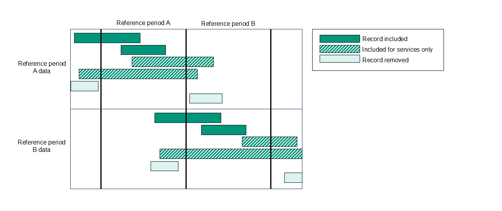

# Filtering to events in period

> Processing steps applied in [`FilterToEventsInPeriod`](/Stored_procedures/create_FilterToEventsInPeriod_procedure.sql) procedure.

[Back to Overview](/Main_tables/docs/methodology/1-overview.md)

## Method

The [selected submissions](/Main_tables/docs/methodology/3-submission-selection.md) are appended (rows concatenated) and events are filtered according to the reference period to which they correspond. N.B for single submissions the reference period is the full 12 months.

**Requests, assessments and reviews** are included if:

- `Event start date` is before the end of the reference period, and
- `Event end date` is within the reference period.

**Services** are included if:

- `Event start date` is before the end of the reference period, and
- `Event end date` is:
  - within the reference period,
  - after the end of the reference period, or
  - `NULL`.

## Notes

- Stricter filtering for services was tested but rejected as some events excluded were not resubmitted in later files due to data quality issues (such as missing end dates or start dates being reset at the beginning of the financial year).
- It is therefore preferable to retain ongoing services and address duplication in later processing steps or caveat in analysis.

 

[Go to Data Cleaning](/Main_tables/docs/methodology/5-data-cleaning.md)