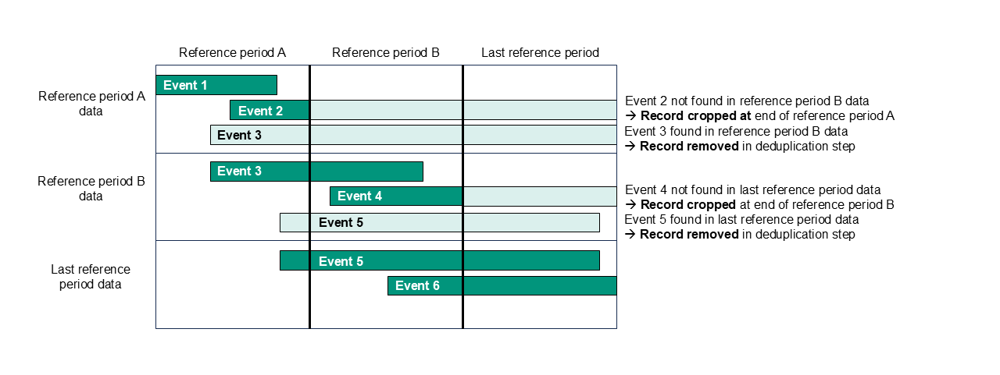

# Deduplication

> Processing steps applied in [`GetDerivedFields`](/Stored_procedures/create_GetDerivedFields_procedure.sql) and [`GetUniqueEvents`](/Stored_procedures/create_GetUniqueEvents_procedure.sql) procedures.

This section documents the three-stage deduplication process applied when joining submissions. The same process is applied for single submissions, though some steps differ or don't apply, as described below.

[Back to Overview](/Main_tables/docs/methodology/1-overview.md)

## Step 1 – Identifying unique events

Records are grouped into “unique events” using the following identifying fields. If **any identifying field differs**, records are treated as different events.

For **joined submissions**, these identifying fields are:

|  | Requests | Assessments | Services | Reviews |
| --- | --- | --- | --- | --- |
| `LA code`                   |✔|✔|✔|✔|
| `Derived person ID`         |✔|✔|✔|✔|
| `Event start date`          |✔|✔|✔|✔|
| `Derived event end date`    |✔|✔| |✔|
| `Client type`               |✔|✔|✔|✔|
| `Request route of access`   |✔| | | |
| `Assessment type`           | |✔| | | 
| `Service type`              | | |✔| |
| `Service component`         | | |✔| |

For **single submissions**, less rigorous deduplication is necessary and more service information can be retained. Therefore, the following fields are also included as identifying fields for services:

|  | Services |
| --- | --- |
| `Delivery mechanism`        |✔|
| `Unit cost`                 |✔|
| `Cost frequency unit type`  |✔|
| `Planned units per week`    |✔|

For each unique event, an event reference (of the form `[LA code]_[event #]`) is derived.

**Notes:**

- These combinations of distinguishing fields for each event type were arrived at following discussions with the local authority analytical working group and extensive experimentation to understand which fields may change between submissions for the same event.
- Raw values are used, except for the derived event end date and combined person ID.
- `Event reference number` is not used (not currently suitable for use).
- This should be considered a DHSC definition of a unique event, rather than a true unique event.


## Step 2 – Cropping and deduplicating service records

This step handles services that appear to be ongoing at the end of a reference period.

- If a service is found in a **later reference period**, the earlier record is **removed**.
- If a service is **not found** in the next reference period, the event end date is assumed to be missing or incorrect and is **cropped to the reference period end date**.



**Notes:**

- Cropping does not apply to the last reference period and therefore **does not apply to single submissions**.
- Missing data in resubmissions may result in cropped end dates.
- Financial‑year start‑date resets can introduce gaps.
- For equipment provision, the true end date is likely to be before the reference period end date.

## Step 3 – Selecting the record to retain

For each unique event, **one original record** is retained using the following criteria (in order):

| Data field | Sort order |
| --- | --- |
| 1. `Reference period end date` * | Descending (most recent at the top) |
| 2. `Derived event end date` | `NULL` end date first**, then descending (most recent at the top) | 
| 3. `Event outcome` | As per hierarchy*** in the ASC CLD guidance |
| 4. `Conversation flag` | Descending (flagged records first) |
| 5. `Database load record ID` | Descending (most recently submitted at the top) |

_\* Reference period start date is not included as it is redundant in addition to reference period end date.
<br> \*\* Event end dates left erroneously open in the last reference period will take precedence.
<br> \*\*\* Event outcome sorted according to the hierarchy in table below:_

```
    Event_Outcome_Hierarchy Event_Outcome_Spec
    1	Progress to reablement/ST-Max
    2	Progress to assessment, review or reassessment
    3	Release 1 specification only: Not mapped
    4	Progress to support planning or services
    5	Continuation of support or services
    6	Admitted to hospital
    7	NFA: Responsibility moved to another local authority
    8	NFA: Referral to NHS services or NHS funded social care
    9	NFA: Self-funded client or under 12wk disregard
    10	NFA: Information and advice or signposting
    11	NFA: Referral to other service within the local authority
    12	NFA: Support declined
    13	NFA: Deceased
    14	NFA: Support ended as planned
    15	NFA: Support ended for other reason
    16	NFA: No services offered for other reason
    17	NFA: Other
```

**Notes:**

- No hybrid records are created, e.g. to populate missing data, update values to the latest or most valid provided, or using bespoke hierachies for each field, as the data required is usually that at the time of the event.
- **Cost fields are dropped** from deduplicated outputs for joined submissions.
- The approach prioritises simplicity, transparency and reproducibility.

## Key implications

- Deduplication is effective for requests, assessments and reviews as these events are only submitted once completed.
- Deduplication is less effective for services due to many fields changing across submissions.

For joined submissions, where more rigourous deduplication is applied to services:

- Packages of care submitted across multiple rows (e.g. double up care) may collapse to a single row.
- Cost information is excluded from the output. (As costs are regularly uplifted, cost analysis should be based on submissions received following each reporting period, rather than the latest data.)
- Events submitted with financial-year start date resets are not effectively deduplicated.

<br>

[Back to Overview](/Main_tables/docs/methodology/1-overview.md)
